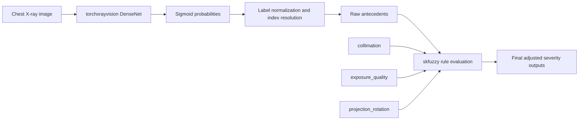

# PACEMAN Fuzzy Logic Documentation

## 1. System Overview

This pipeline implements a dual-tier medical image quality adjustment framework for chest X-ray analysis.

The first tier is a pretrained `torchxrayvision` DenseNet model that produces raw pathology probabilities from the image. The second tier is an `skfuzzy` Fuzzy Inference System (FIS) that performs a strict multi-variable cross-examination before accepting any pathology score as clinically reliable.

Unlike an isolated quality-check approach, the current architecture evaluates all three PACEMAN criteria simultaneously for each pathology decision. A pathology score is only preserved when the raw model signal and the three quality inputs are jointly consistent with a technically valid radiograph. If any single quality criterion is poor or outside range, the final pathology severity is forced down to Low Severity.

The design goal is not to replace the neural network, but to gate its outputs using clinically relevant acquisition quality indicators. In practice, this makes high raw probabilities less likely to be treated as trustworthy when the image is technically compromised.

## 2. PACEMAN Quality Criteria & Universe Ranges

The implementation uses three quality antecedents only. Each antecedent is modeled as a continuous fuzzy variable with a clinically interpretable universe of discourse and three linguistic sets.

### 2.1 `collimation`

- Physical meaning: field size and centering of the X-ray beam relative to the anatomy of interest.
- Universe of discourse: `0.0` to `3.0`
- Intended grading semantics:
  - Grade 0: poor collimation / excessive field / anatomical overexposure
  - Grade 2: acceptable collimation
  - Grade 3: ideal collimation

Implemented membership functions:

| Fuzzy set | Type | Breakpoints | Interpretation |
| --- | --- | --- | --- |
| Grade 0 / poor | `trapmf` | `[0.0, 0.0, 0.4, 1.0]` | Strong membership for severe collimation error |
| Grade 2 / acceptable | `trimf` | `[0.8, 2.0, 2.4]` | Mid-band acceptable technique |
| Grade 3 / ideal | `trapmf` | `[2.2, 2.7, 3.0, 3.0]` | Near-perfect collimation |

### 2.2 `exposure_quality`

- Physical meaning: CareStream-style Exposure Indicator behavior used as a proxy for image penetration / exposure adequacy.
- Universe of discourse: `1500.0` to `2500.0`
- Clinical target band: approximately `1700` to `2300`
- Ideal exposure indicator: `2000`

Implemented membership functions:

| Fuzzy set | Type | Breakpoints | Interpretation |
| --- | --- | --- | --- |
| Grade 0 / 1 outside range | `trapmf` | `[1500.0, 1500.0, 1700.0, 1850.0]` | Under-penetrated / technically unreliable region |
| Grade 2 / ideal | `trimf` | `[1700.0, 2000.0, 2300.0]` | Preferred operating band centered on 2000 |
| Grade 3 / high end | `trapmf` | `[2250.0, 2350.0, 2500.0, 2500.0]` | Upper-end exposure region |

This structure produces a peak at the ideal indicator of `2000` while preserving slopes into the accepted diagnostic band from `1700` to `2300`.

### 2.3 `projection_rotation`

- Physical meaning: severity of patient rotation, tilting, or nonstandard projection alignment.
- Universe of discourse: `0.0` to `3.0`
- Intended grading semantics:
  - Grade 0/1: severe rotation or tilting
  - Grade 2: minimal rotation
  - Grade 3: zero rotation / optimal projection

Implemented membership functions:

| Fuzzy set | Type | Breakpoints | Interpretation |
| --- | --- | --- | --- |
| Grade 0 / 1 severe | `trapmf` | `[0.0, 0.0, 1.0, 1.3]` | Strong membership for rotation error |
| Grade 2 / minimal | `trimf` | `[1.1, 2.0, 2.3]` | Small but not perfect alignment error |
| Grade 3 / zero | `trapmf` | `[2.2, 2.7, 3.0, 3.0]` | Ideal projection alignment |

## 3. Raw Pathology Inputs & Severity Outputs

### 3.1 Raw neural network signals

The raw deep-learning probabilities are modeled as antecedents over the range `0.0` to `1.0`.

Linguistic terms:

- Low
- Medium
- High

Variables currently represented in the implementation:

- `raw_cardiomegaly`
- `raw_consolidation`
- `raw_hernia`

The current membership function structure is shared across all three raw inputs:

| Linguistic term | Type | Breakpoints |
| --- | --- | --- |
| Low | `trimf` | `[0.0, 0.0, 0.35]` |
| Medium | `trimf` | `[0.2, 0.5, 0.8]` |
| High | `trimf` | `[0.65, 1.0, 1.0]` |

### 3.2 Final adjusted outputs

The fuzzy outputs are modeled as severity consequents over the range `0` to `100%`.

Linguistic terms:

- Low Severity
- Moderate Severity
- High Severity

Variables currently represented in the implementation:

- `final_cardiomegaly`
- `final_consolidation`
- `final_hernia`

The current membership function structure is shared across all three final outputs:

| Linguistic term | Type | Breakpoints |
| --- | --- | --- |
| Low | `trimf` | `[0.0, 0.0, 35.0]` |
| Moderate | `trimf` | `[20.0, 50.0, 80.0]` |
| High | `trimf` | `[60.0, 100.0, 100.0]` |

## 4. Clinical Inference Rules Matrix

The control system uses Mamdani-style rules with a Clinical Gatekeeping design. The downgrade logic is intentionally conservative: each pathology is assessed against all three PACEMAN criteria at the same time, and the decision is only allowed to remain high when all three quality conditions are ideal.

### 4.1 Rules summary

| Raw signal | PACEMAN quality condition | Final behavior |
| --- | --- | --- |
| Low | Any quality combination | Low Severity |
| Medium | All three criteria ideal | Moderate Severity |
| High | All three criteria ideal | High Severity |
| High | Any single criterion poor or outside range | Low Severity (Suppressed) |

### 4.2 Clinical Gatekeeping behavior

The system now follows a strict gatekeeping rule:

- If `collimation` is poor, the final pathology severity is forced to Low Severity.
- If `exposure_quality` is outside the clinical band, the final pathology severity is forced to Low Severity.
- If `projection_rotation` is severe, the final pathology severity is forced to Low Severity.

This gating behavior applies regardless of whether the raw `torchxrayvision` signal is High. In other words, a high neural-network score cannot override a technically poor radiograph.

A High Severity output is only achievable if the raw signal is High and all three quality conditions are simultaneously in their ideal states.

### 4.3 Explicit downgrade scenarios implemented in code

#### Severe projection rotation downgrades `final_cardiomegaly`

When `projection_rotation` belongs to the severe Grade 0/1 trap membership, any cardiomegaly rule branch is suppressed to Low Severity. This reflects the clinical risk that rotation can distort the mediastinal silhouette and heart size impression.

#### Out-of-bounds exposure indicator downgrades `final_consolidation`

When `exposure_quality` falls outside the `1700` to `2300` band, the system treats the signal as technically unreliable and suppresses `final_consolidation`. This matches the PACEMAN objective of reducing false-positive lung whitening interpretations under poor penetration.

#### Poor collimation downgrades `final_hernia`

When `collimation` is Grade 0, the system downgrades `final_hernia` to Low. In the implementation, this is used as a strict quality penalty for the downstream pathology signal whenever the field of view is technically poor.

### 4.4 Combined combinations matrix

| Raw Signal | Collimation | Exposure Quality | Projection/Rotation | Final Output Severity |
| :--- | :--- | :--- | :--- | :--- |
| Low | Any State | Any State | Any State | Low Severity |
| Medium | Ideal (Grade 3) | Ideal (Grade 2) | Zero (Grade 3) | Moderate Severity |
| High | Ideal (Grade 3) | Ideal (Grade 2) | Zero (Grade 3) | High Severity |
| High | Poor (Grade 0) | Ideal (Grade 2) | Zero (Grade 3) | Low Severity (Suppressed) |
| High | Ideal (Grade 3) | Outside Range | Zero (Grade 3) | Low Severity (Suppressed) |
| High | Ideal (Grade 3) | Ideal (Grade 2) | Severe (Grade 0/1) | Low Severity (Suppressed) |

This matrix is instantiated separately for `final_cardiomegaly`, `final_consolidation`, and `final_hernia`, but the gating principle is identical for all three outputs. The decision tree no longer evaluates quality factors independently; it evaluates the full PACEMAN triplet as a single clinical validity check.

### 4.5 Combined `&` syntax used in the code builder

The implementation expresses the combined cross-examination directly in the rule base using chained logical conjunctions. Conceptually, the rule builder follows this pattern:

```python
ctrl.Rule(
  raw_consolidation["high"]
  & collimation["grade_3_ideal"]
  & exposure_quality["grade_2_ideal"]
  & projection_rotation["grade_3_zero"],
  final_consolidation["high"],
)

ctrl.Rule(
  raw_consolidation["high"]
  & collimation["grade_0_poor"],
  final_consolidation["low"],
)
```

The same pattern is used for the other pathology branches, with the rule generator expanding the PACEMAN criteria into a strict all-three-criteria gate.

## 5. Data Extraction & Architecture Map

### 5.1 Extraction pipeline

The extraction path is designed to transform a torchxrayvision output tensor into a fuzzy-system-ready dictionary.

1. The model returns logits for the full pathology vocabulary.
2. The code applies `sigmoid` to convert logits into probabilities.
3. A normalization layer resolves the label index for each target pathology, even when the model vocabulary uses lowercase, spacing, or punctuation variants.
4. The resolved probability is written to a canonical raw antecedent key.

### 5.2 Canonical antecedent mapping

The raw extraction output is normalized to the following keys:

- `raw_cardiomegaly`
- `raw_consolidation`
- `raw_hernia`

This creates a stable interface between the neural network tier and the fuzzy tier.

### 5.3 Label normalization layer

The implementation uses a label-normalization helper that removes non-alphanumeric characters and converts labels to lowercase before comparison. This allows the system to tolerate small naming variations from different torchxrayvision weight sets or vocabulary presentations and still map directly into the raw antecedents used by the FIS.

Behaviorally, this means the following kinds of labels can still be matched safely:

- `Cardiomegaly`
- `cardiomegaly`
- `Cardiomegaly `
- `cardiomegaly` with minor punctuation differences
- `HERNIA` or `Hernia`
- labels that differ only by spacing or punctuation

### 5.4 Architecture map



### 5.5 Practical integration note

The data extraction layer is intentionally kept separate from image preprocessing. This prevents changes in image-loading code from destabilizing the fuzzy logic definition and makes the FIS easier to validate in a clinical engineering review.

## 6. Implementation Notes

- The current script is structured for explainability rather than maximal automation.
- The fuzzy curves are human-readable and can be tuned without retraining the deep model.
- The exposure-quality curve explicitly centers on `2000` with accepted slope support into the `1700` to `2300` band, matching the PACEMAN interpretation requested for review.
- The extraction fallback is normalization-based, so future model variants with slightly different pathology labels can still be integrated without rewriting the fuzzy rule base.
- The rule system is intentionally strict: combined PACEMAN quality criteria act as a clinical gate, not as independent advisory signals.

## 7. Review Checklist for Clinical Engineering

- Confirm the chosen PACEMAN grade interpretations with the site protocol.
- Validate whether the current `exposure_quality` breakpoints should be aligned with institution-specific detector calibration.
- Verify that `final_hernia` is the desired downstream output for the collimation-based rule branch.
- Confirm whether the exact pathology vocabulary from the deployed torchxrayvision weight set includes `Hernia` or a near-equivalent label.
