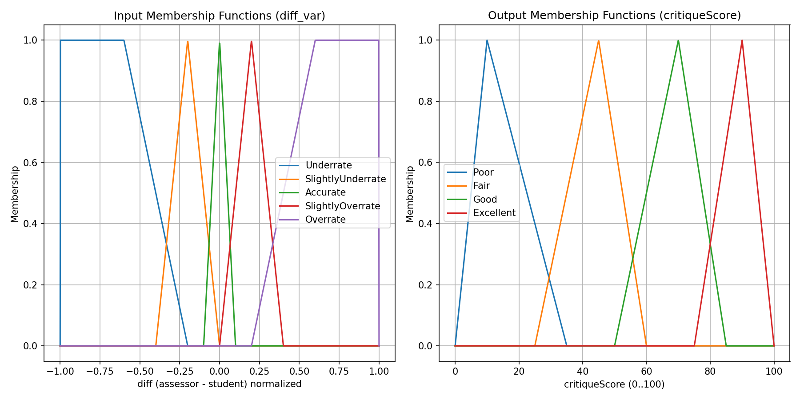

# Fuzzy System Architecture for Imaging Critique (Section 6)

This document describes a focused fuzzy-logic architecture for the imaging/image-critique portion of the evaluation system. It targets the use-case where a student produces an X-ray, self-critiques it, and an assessor provides the ground-truth — the fuzzy system evaluates the *accuracy* of the student's critique and provides a quality/recommendation output.

---

## 1. Crisp Inputs

- Source: Section 6 form fields (student and assessor scores)
- Example input variables (each typically 1–3 or 1–4 discrete scores):
  - `identifikasi` (identification)
  - `penanda` (marker placement)
  - `kawasanDedahan` (exposed area)
  - `projeksi` (projection correctness)
  - `kolimasi` (collimation)
  - `kontras` (contrast/density)
  - `artifak` (artifacts)
  - `variasiAnatomikal` (anatomical variation handling)
  - `perluUlang` (need for repeat)
  - `projeksiTambahan` (need for additional projections)

- Preprocessing: convert categorical choices (Ya/Tidak) to numeric, normalize ranges to a common domain (e.g., 0..1) if needed.

- For critique-accuracy FIS, compute per-field difference:
  - `diff_var = assessor_var - student_var` (signed or absolute)
  - Use `diff_var` as fuzzy input (range: -2..+2 or normalized -1..+1)

---

## 2. Human Expert FIS

- Build an expert-designed Mamdani FIS initially:
  - Define linguistic input terms for `diff_var`: `Underrate`, `SlightlyUnderrate`, `Accurate`, `SlightlyOverrate`, `Overrate`.
  - Output linguistic terms for overall critique: `Poor`, `Fair`, `Good`, `Excellent` and separate binary `RetakeRecommendation` (`Yes`, `Maybe`, `No`).

- Example expert rules:
  - IF many diffs are `Accurate` THEN `critique = Excellent`.
  - IF several important diffs are `Overrate` THEN `critique = Poor`.
  - IF `kolimasi` is `Overrate` AND `kontras` is `Overrate` THEN `retake = Yes`.

- Rule base is intentionally small (dozens) and interpretable.

---

## 3. Membership Functions

- Input MF suggestions (for `diff_var` normalized to [-1, 1]):
  - `Underrate` — Trapezoid left: [-1, -1, -0.6, -0.2]
  - `SlightlyUnderrate` — Triangular: [-0.4, -0.2, 0]
  - `Accurate` — Triangular: [-0.1, 0, 0.1]
  - `SlightlyOverrate` — Triangular: [0, 0.2, 0.4]
  - `Overrate` — Trapezoid right: [0.2, 0.6, 1, 1]

- Output MF (critique quality on 0..100):
  - `Poor` — Triangular: [0, 10, 35]
  - `Fair` — Triangular: [25, 45, 60]
  - `Good` — Triangular: [50, 70, 85]
  - `Excellent` — Triangular: [75, 90, 100]

- Shapes: Triangular and trapezoidal recommended for interpretability. Gaussian can be used for smoother results.



---

## 4. FIS Shape (Mamdani) and Defuzzification

- Inference: Mamdani (min–max aggregation)
- Implication: min (clipping)
- Aggregation: max across rules
- Defuzzification: Centroid (COG) for continuous output

- For `RetakeRecommendation` you can use Sugeno-style (0/0.5/1) or threshold the numeric output.

---

## 5. FCM Clustering (Initialization/Rule Suggestion)

- Use Fuzzy C-Means (FCM) on historical labeled differences to:
  - Suggest initial cluster centers for membership functions
  - Group similar error patterns (e.g., consistent overrating of contrast)

- Steps:
  1. Collect training samples: vector of diffs for criteria + ground-truth overall assessment (if available).
  2. Run FCM (k = 3..5) to find cluster prototypes.
  3. Map cluster centers to initial MF centers (e.g., center ~ 0 means `Accurate`).

- Benefit: data-driven initialization that keeps fuzzy interpretability.

---

## 6. Genetic Algorithm / SOM for Optimization

- Purpose: Optimize MF parameters (centers, widths) and optionally rule weights.

- GA design:
  - Chromosome: concatenated MF parameters (e.g., left/center/right points for triangular MFs) and optional rule weight scalars.
  - Fitness: error between FIS outputs and assessor-labeled ground truth (e.g., mean squared error for numeric quality or classification accuracy for categorical labels). Penalty for complexity to keep interpretability.
  - Operators: tournament selection, BLX-α or arithmetic crossover for real-valued genes, gaussian mutation.
  - Elitism: keep top-N across generations.

- SOM alternative:
  - Use for visualization / cluster mapping of patterns; not necessary for MF optimization but useful for exploratory analysis.

- Usage:
  - Train GA on historical dataset (k-fold CV). Use multiple random seeds to ensure stability.
  - Save optimized MF parameters and record performance metrics.

---

## 7. Rule Extraction & Tuning

- Rule extraction methods:
  - Expert-curated rules (start here).
  - Wang–Mendel: extract rules from labeled examples by mapping inputs to highest membership terms and collecting rules.
  - Clustering-based rules: use clusters to propose antecedent combinations.

- Tuning:
  - GA can tune rule weights and MF parameters simultaneously.
  - Optionally prune low-impact rules (weight < threshold) for compactness.

---

## 8. Data-Driven Output

- Output types:
  - Numeric `critiqueScore` (0..100): continuous measure of critique accuracy
  - Categorical `critiqueCategory` (Poor/Fair/Good/Excellent)
  - `retakeRecommendation`: `Yes`/`Maybe`/`No`
  - `errorBreakdown`: per-criterion flags (e.g., `kolimasi_overrate: true`)

- Store fuzzification results as JSON in the evaluation record, e.g. `fuzzyResults` field in `Evaluation` model:

```json
{
  "critiqueScore": 72.4,
  "critiqueCategory": "Good",
  "retakeRecommendation": "Maybe",
  "ruleActivations": [{"ruleId":1,"activation":0.6}, ...],
  "perCriterionDiffs": {"kontras":0.4, "kolimasi":-0.2}
}
```

- Make storage optional (toggle in UI). If stored, it enables later GA training and auditing.

---

## 9. Inference Engine Implementation

- Languages / libs:
  - Node/TS: custom (small) Mamdani engine, or use libraries such as `fuzzylogic-js` if acceptable.
  - Python (research): `scikit-fuzzy` for experiments and GA training.

- API design:
  - POST `/api/evaluations/{id}/fuzzy-critique` — compute fuzzy analysis for a saved section; request body: `{ studentScores: {...}, assessorScores: {...}, options: {store:false} }`.
  - GET `/api/evaluations/{id}/fuzzy-critique` — retrieve stored fuzzy results.

- Execution placement:
  - Recommended: server-side compute during assessor save (reliable, auditable). Optionally provide client-side preview using same JS engine.

---

## 10. Crisp Outputs (How to present results)

- Numeric summary (0..100) with category label
- Visual indicators:
  - Radar chart comparing student vs assessor
  - Highlight criteria where |diff| > threshold
  - Rule trace panel: show top rules that fired and their activation strengths

- Actions:
  - `retakeRecommendation` with suggested corrective action (e.g., "Review collimation and contrast technique")
  - Option for assessor to accept or override fuzzy output before storing

---

## 11. Evaluation & Metrics

- Metrics for GA tuning and system validation:
  - Classification accuracy vs assessor labels
  - Mean absolute error (MAE) between numeric outputs and assessor ground-truth
  - Confusion matrix for categorical outputs
  - Interpretability measure (number of rules, MF simplicity)

- Human-in-the-loop testing:
  - Present fuzzy outputs to assessors and collect feedback for iterative tuning.

---

## 12. Integration Roadmap (practical incremental steps)

1. Implement a small JS Mamdani engine and server API endpoint.
2. Add `fuzzyResults` JSON field to `Evaluation` model (optional in DB schema).
3. Build an initial expert rule base covering 8–12 common rules.
4. Run FCM on historical diffs (if data exists) to initialize MF centers.
5. Add GA optimizer (Python or Node) to tune MF parameters offline.
6. Expose UI: preview and store options, rule trace visualization.
7. Collect assessor feedback and iterate.

---

## 13. Example Mapping for Section 6

- Use these fields for `diff` inputs:
  - `identifikasi`, `penanda`, `kawasanDedahan`, `projeksi`, `kolimasi`, `kontras`, `artifak`, `variasiAnatomikal`, `perluUlang`, `projeksiTambahan`

- Example simple rule:
  - IF `identifikasi` is `Accurate` AND `penanda` is `Accurate` AND `kontras` is `Accurate` THEN `critique` is `Excellent`.

---

## 14. Notes on Interpretability & Course Requirements

- For an academic project, strongly prefer Mamdani + triangular/trapezoidal MFs to keep everything explainable.
- Use GA only to *suggest* parameter adjustments; keep final MFs human-readable and presentable in documentation.

---

## Appendix: References & Tools

- `scikit-fuzzy` (Python) — prototyping and GA experiments
- `fuzzylogic-js` or similar (JS) — light-weight JS fuzzy libraries
- FCM implementations in `skfuzzy` or custom TS implementations
- GA libraries: `genetic-js` (JS) or `DEAP` (Python)


---

If you'd like, I can now:
- generate a minimal JS Mamdani engine and API endpoint prototype, or
- create the initial expert MF and rule base for Section 6, or
- prepare a small dataset extractor to gather diff vectors for GA training.

Tell me which of these to start with next.